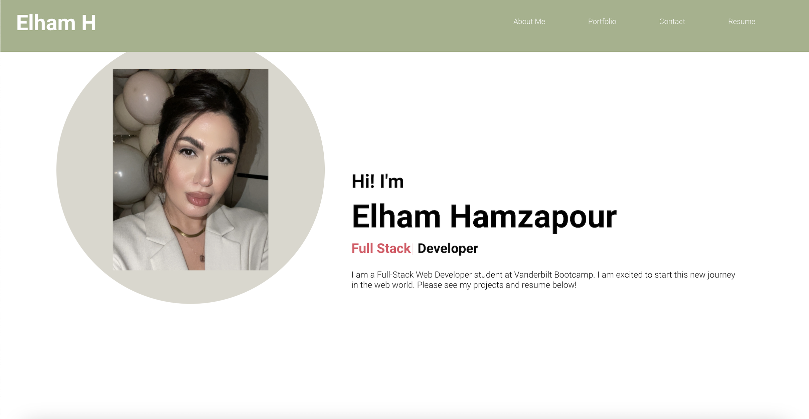

# React-Portfolio

## Table of Contents
* General Info
* Installation
* Collaborations
* Screenshot
* Deployed Link

## General Information
This application was created to build a portfolio using React. The portfolio displays a header, content, and a footer. Header consisting of a navigation bar and developer's name. About, portfolio ,contact form, and resume are displayed in the content section. Links to GitHub and LinkedIn are in the footer.  Credit goes to Safak Kocaoglu's Youtube tutorial https://www.youtube.com/watch?v=7WwtzsSHdpI on how to create a react portfolio. 

## Installation
* `npx create-react-app`
* `npm install`
* `npm start`

## Collaborations
Email: ehamzapour@gmail.com

## Screenshot

## Deployed Link
Couldn't deploy link now, will deploy later. 